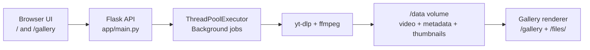

# Cloudflare Downloader

Fast, self-hosted video downloading with a clean queue UI and gallery.  
Schneller, selbst gehosteter Video-Downloader mit Queue-UI und Galerie.

[](https://www.python.org/)
[](https://flask.palletsprojects.com/)
[](https://www.docker.com/)
[](/LICENSE)

## Features / Funktionen

- Async background download queue with instant API response.
- Mehrere URLs pro Anfrage (eine URL pro Zeile im UI).
- Job status polling via `/api/status/<job_id>`.
- Galerie mit Thumbnail, Titel, Uploader und Download-Links.
- Safe delete endpoint for media + sidecar files (`.info.json`, thumbnails).
- Health endpoint (`/healthz`) and Docker-first deployment.

## Architecture / Architektur



### Components / Bausteine

- `app/main.py`: Routes, queue worker, yt-dlp integration, status tracking, cleanup.
- `app/templates/index.html`: Downloader UI with queue display and polling.
- `app/templates/gallery.html`: Media gallery with search and delete actions.
- `Dockerfile` + `docker-compose.yml`: Runtime image, dependencies, service wiring.

## Setup

### Option A (Recommended): Docker / Docker Compose

```bash
git clone https://github.com/cancel-cloud/cloudflare-downloader.git
cd cloudflare-downloader
docker compose up -d --build
curl -f http://127.0.0.1:8000/healthz
```

Open: `http://127.0.0.1:8000`

### Option B: Local Python environment

```bash
python -m venv .venv
source .venv/bin/activate
pip install -r requirements.txt
python app/main.py
```

Or production-style locally:

```bash
gunicorn -w 4 -b 0.0.0.0:8000 app.main:app
```

## Configuration / Konfiguration

| Variable | Default | Description (EN/DE) |
|---|---:|---|
| `BASE_DOWNLOAD_DIR` | `/data` | Download target path / Zielordner fuer Downloads |
| `MAX_CONCURRENT_DOWNLOADS` | `4` | Worker threads for concurrent jobs / Anzahl paralleler Download-Threads |

`docker-compose.yml` maps host storage to container `/data` (default: `/srv/cloudflare-downloader:/data`).

## Usage / Verwendung

### Web UI flow / Ablauf

1. Open `/`.
2. Paste one or multiple video URLs (one per line).
3. Start downloads and monitor queue status.
4. Open `/gallery` to browse and manage downloaded media.

### API examples

Start a download:

```bash
curl -X POST http://127.0.0.1:8000/download \
  -H "Content-Type: application/x-www-form-urlencoded" \
  --data-urlencode "u=https://youtu.be/iLo5iDzS2Ds"
```

Check job status:

```bash
curl http://127.0.0.1:8000/api/status/<job_id>
```

Delete a downloaded file:

```bash
curl -X POST http://127.0.0.1:8000/delete \
  -F "filename=Example_Title_[abc123].mp4"
```

Health check:

```bash
curl -f http://127.0.0.1:8000/healthz
```

## Troubleshooting (Short) / Fehlerbehebung (Kurz)

### Download fails (403 or extractor errors)

- Rebuild with latest dependencies:

```bash
docker compose down
docker compose up -d --build
```

- Check container logs:

```bash
docker compose logs -f cloudflare-downloader
```

- Verify runtime tools inside container:

```bash
docker compose exec cloudflare-downloader yt-dlp --version
docker compose exec cloudflare-downloader node --version
docker compose exec cloudflare-downloader ffmpeg -version
```

Quick checklist:

- URL is valid and publicly accessible.
- `yt-dlp` is up to date in the rebuilt image.
- `node` and `ffmpeg` are available in the container.

## Legal / Responsible Use

Use this project only for content you are legally permitted to download and store.  
Bitte nutze dieses Projekt nur fuer Inhalte, fuer die du eine rechtliche Erlaubnis hast.

You are responsible for complying with platform terms, copyright law, and local regulations.  
Die Verantwortung fuer die Einhaltung von Plattformregeln, Urheberrecht und lokalen Gesetzen liegt beim Betreiber/Nutzer.

## Roadmap

- Shared job state backend (Redis) for robust multi-worker deployments.
- Optional authentication and rate limiting for public exposure.
- Better retry telemetry and richer failure diagnostics.
- More source-specific extraction profiles and quality controls.

